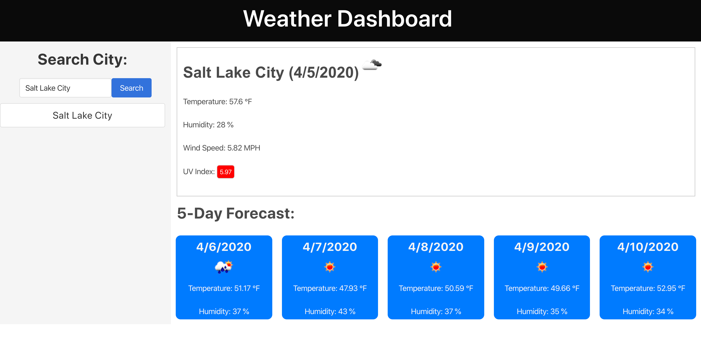
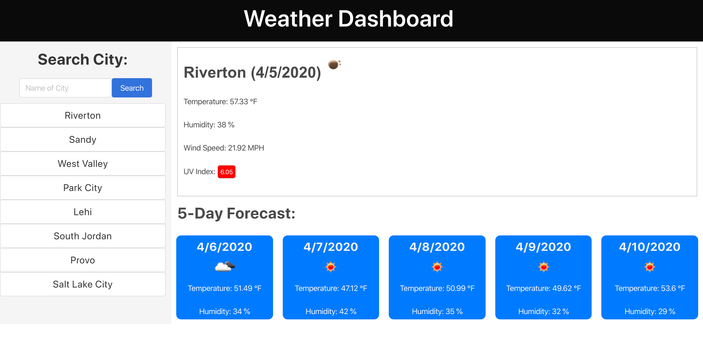
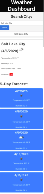

# Weather-Dashboard
#### https://jinj95.github.io/Weather-Dashboard/
#### To start enter the name of a city and press search. A button will be generated with the name of your desired city. Once you select the button with the name of the city the current weather conditions along with a five day forecast for that city will be displayed. Weather information is provided courtesy of https://openweathermap.org/api !

#### You can search different cities and generate a button for each. Once a city is clicked a weather forecast for that city will be displayed.

#### This web application is fully responsive!

